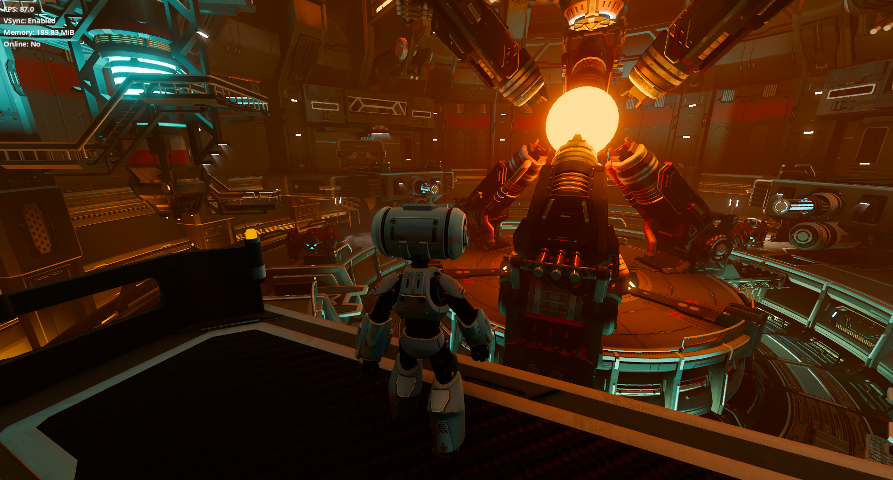
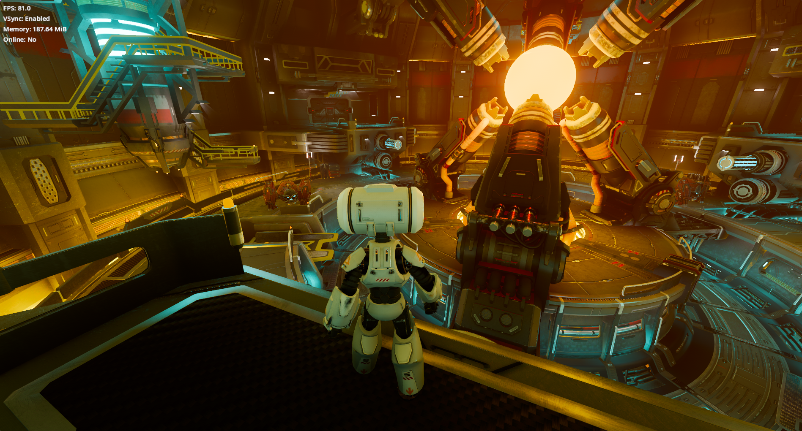

# godot-rust-tps-demo

A Rust rewrite of the official Godot [Third Person Shooter Demo](https://github.com/godotengine/tps-demo),
using [godot-rust (gdext)](https://github.com/godot-rust/gdext) — Godot 4.7, `godot` crate 0.5.5.

The original demo is written in GDScript. This repository replaces **every** script with a Rust
class registered through GDExtension; the scenes, models, textures, audio and lightmaps are the
original ones.

## Screenshots

| SDFGI | VoxelGI |
|---|---|
|  |  |

<sub>Captured from the finished Rust port (global illumination selectable in the in-game settings).</sub>

## Versions

The rewrite happens in three phases, each on its own branch. They are not successive drafts of
the same code: v2 and v3 are two independent reference templates, and v1 is kept as a baseline.

| | v1 — raw port | v2 — idiomatic Rust | v3 — ECS |
|---|---|---|---|
| **Branch** | `main` | `v2` (branched from the end of v1) | `v3` (branched from v2) |
| **Goal** | Make the original game run entirely in Rust with identical behavior, script by script | Remodel the code around Rust's type system and idioms, plus the infrastructure a real project needs | Rebuild the v2 design on top of `bevy_ecs`, with ECS driving the Godot nodes |
| **Approach** | Direct translation of each GDScript file into one gdext class with the same base node; no abstractions, no optimizations — "Rust that still reads like GDScript" | Typed access everywhere (no dynamic `get`/`call`), proper structs and enums for state, a signal-driven scene manager, shared helpers where duplication existed, performance and readability passes | Components and systems for gameplay state; Godot nodes as the presentation/physics layer synchronized from the ECS world |
| **Godot ↔ Rust boundary** | Whatever the original did dynamically stays dynamic (`has_method`, `has_signal`, `rpc("name")`, autoload reached by path); node types swapped in the scenes | Typed `Gd<T>` references between classes, typed signals, typed autoload | ECS world owned by a Rust singleton; nodes read/write components |
| **Upstream behavior** | Preserved, including quirks; only objective upstream bugs fixed, minimally (3 so far, see `docs/upstream-bugs.md`) | Quirks reviewed one by one from `docs/v2-backlog.md` (26 items) | Inherits v2 |
| **Intended use** | Historical reference, benchmark baseline, example of a raw port | Reference template for Godot + Rust projects without ECS | Reference template for Godot + Rust projects with ECS |
| **Status** | **Complete** — 15/15 scripts ported, 0 `.gd` left, game playable end to end | Not started | Not started |

> **Note:** for real projects, take examples only from **v2** and **v3**. v1 deliberately keeps
> GDScript idioms, dynamic calls and upstream quirks so that behavior could be compared script by
> script; it is a baseline, not a template.

Rules for each phase are in [`.specify/memory/constitution.md`](.specify/memory/constitution.md).

## Layout

```
oxide-godot/          Godot 4.7 project (scenes + assets from the original demo, extension.gdextension)
oxide_godot_core/     Cargo workspace; crate `oxide_godot` (cdylib) in oxide_godot_lib/
docs/                 port order, upstream bugs found and fixed, v2 backlog
specs/                Spec Kit specifications, plans and tasks for each milestone
```

## Building and running

```bash
cd oxide_godot_core && cargo build
```

Then open `oxide-godot/project.godot` in Godot 4.7 and run. The debug build of the library is
loaded by `oxide-godot/extension.gdextension`.

## Licenses

- **Rust code** (`oxide_godot_core/`) and everything else authored in this repository (docs, specs):
  [MIT](LICENSE).
- **Original assets, scenes and the GDScript code they derive from** (`oxide-godot/`): licensed by
  the upstream project. See the upstream license file directly:
  <https://github.com/godotengine/tps-demo?tab=License-1-ov-file> — a copy ships as
  [`oxide-godot/LICENSE.md`](oxide-godot/LICENSE.md) (assets and music under CC-BY 3.0 by their
  respective authors; original code under MIT by Juan Linietsky and the Godot Engine contributors).

## Template

The base project layout (`oxide-godot/` + `oxide_godot_core/` workspace, `extension.gdextension`,
crate wiring) was generated with the [godust](https://crates.io/crates/godust) tooling; the port
was built on top of that scaffold.
